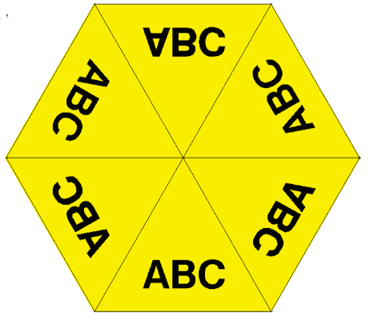
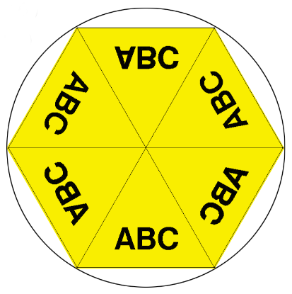
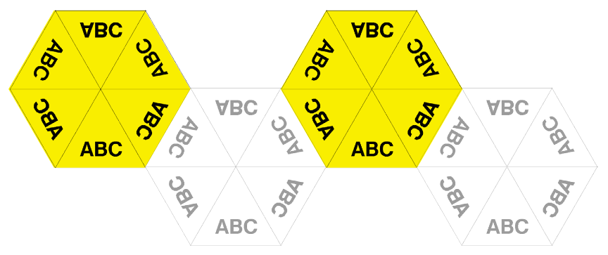
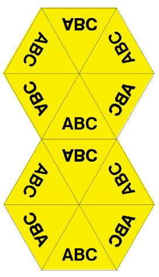
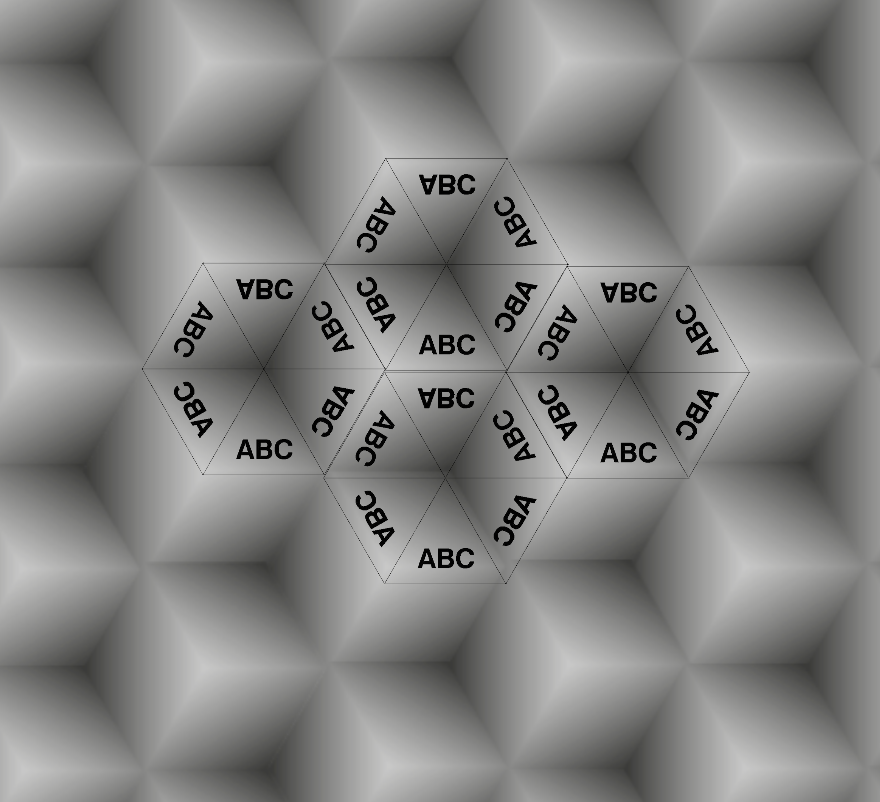

</img>

# honeycomb-js 

A bee flew into my room today and I thought about how they make [honeycombs](https://en.wikipedia.org/wiki/Honeycomb).
# Demo

You can play around with the resulting patterns by moving the cursor and pressing `+` or `-` on your keyboard. To see the tesselation grid hit `d`. Make sure the browser window has the focus by clicking on the image, otherwise keys won't work. 

Demo: [honeycomb-js](https://fgrimme.github.io)

There is also a small gallery of 3d'ish op-art patterns.

Gallery: [patterns](#pattern-gallery) 


#How it works

**honeycomb-js** is an implementation of a simple [Kaleidoscope](https://en.wikipedia.org/wiki/Kaleidoscope). It creates symmetric patterns based on an input image. It is a fun project and I use it to create background images for websites. There are some samples in the backgrounds directory.

The code is written in Processing first and is then exported to JavaScript. You can find the Java/Processing implementation here [honeycomb](https://github.com/fgrimme/honeycomb) and the Android version here [SymDroid](https://github.com/fgrimme/SymDroid).


To simulate the Kaleidoscope functionality, a hexagon is created consisting of six triangles as the basic shape. The triangles are rendered with a texture taken from a reference image. The source area for the texture is controlled by the cursor position. 

**Rotation**

Next, the triangles get rotated by 60° each. To create a symmetrical image the texture is mirrored alternatingly along the x-axis. 

</img>


The coordinates for the triangle rotation can be easily calculated by imagining a surrounding circle. 


</img>


```javascript
x = RADIUS * cos( TWO_PI / 6)
y = RADIUS * sin( TWO_PI / 6 )
```

**Horizontal Tesselation**


The resulting hexagonal shape is tesselated over the entire canvas. First horizontally and then vertically.
The position on the x-axis is calculated by adding the radius times three to the last position. 


</img>


```javascript
x += RADIUS * 3
```

**Vertical Tesselation**

The position on the y-axis is caculated by the square root of half the radius times three (angle bisector in equilateral triangle).

</img>

```javascript
y += sqrt(3) * (RADIUS / 2)
```

**Honeycomb Tesselation**

Not very precise ~ my Gimp skills are not the best :-)

</img>

#Keymap

> Some of the functions could not be ported to the JS version.

| Key   | Function            |
|-------|-----------------------
| m     | next image          |
| n     | previous image      |
| +     | increase radius     |
| -     | decrease radius     |
| r     | record              |
| k     | jump right          |
| p     | screenshot          |
| c     | move circular       |
| d     | toggle mouse        |
| v     | toggle direction    |
| y     | increase velocity   | 
| x     | decrease velocity   |
| i     | show image path     |
| t     | toggle transparency |
| j     | jump down           |
| h     | jump left           |
| u     | jump up             |
| 1     | reset image         |
| 2     | invert image        |
| 3     | desaturate image    |
| 4     | blur image          |
| 5     | bitmap image        |
| 6     | posterize image     |
| 7     | erode image         |
| 8     | dilate image        |
| UP    | move up             |
| DOWN  | move down           |
| LEFT  | move left           |
| RIGHT |move right           |

#Pattern Gallery

</img>

</img>

</img>

</img>

</img>

</img>

</img>

</img>

</img>

</img>

</img>

</img>

</img>

</img>

</img>

</img>

</img>

</img>

</img>

</img>

</img>


